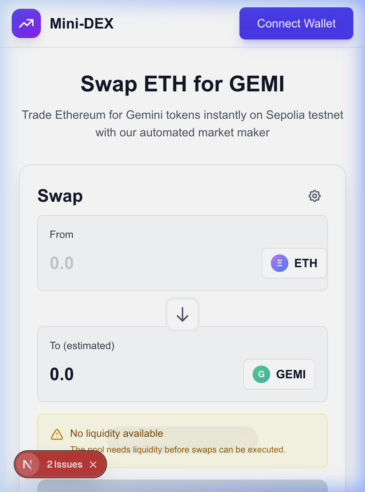

# Mini-DEX - Advanced Decentralized Exchange

A production-ready decentralized exchange (DEX) for swapping ETH to GEMI tokens on Sepolia testnet, featuring automated market maker (AMM) mechanics, property-based testing, and comprehensive security measures.

🚀 **Live Demo**: [https://frontend-chi-wheat-42.vercel.app](https://frontend-chi-wheat-42.vercel.app)


---

## 📱 Mobile Responsive

Fully responsive design built with Tailwind CSS - works seamlessly on desktop, tablet, and mobile devices.

<p align="center">
  
</p>

---

## 🔗 Deployed Contracts (Sepolia Testnet)

| Contract | Address | Etherscan |
|----------|---------|-----------|
| **GeminiToken** | `0xEB9B3c675aD7419bcE73fD8eb2d5C9BCDd8a8FD7` | [View](https://sepolia.etherscan.io/address/0xEB9B3c675aD7419bcE73fD8eb2d5C9BCDd8a8FD7) |
| **SimplePool** | `0x7D7ff9c51eb5c3dcbeD2751c6F3bd70586eB22Db` | [View](https://sepolia.etherscan.io/address/0x7D7ff9c51eb5c3dcbeD2751c6F3bd70586eB22Db) |

**Deployment Transaction**: [`0xd1a55f2ba930e24385c2477974daeae52035fdfa6b1d7f7a66ab0d2f9fa8efd3`](https://sepolia.etherscan.io/tx/0xd1a55f2ba930e24385c2477974daeae52035fdfa6b1d7f7a66ab0d2f9fa8efd3)

---

## 🎯 Advanced Features

### Smart Contract Features
- ✅ **Inter-contract Calls**: SimplePool interacts with GeminiToken for transfers
- ✅ **Custom ERC-20 Token**: Gas-optimized with custom errors
- ✅ **AMM Liquidity Pool**: Constant product formula (x * y = k)
- ✅ **Reentrancy Protection**: OpenZeppelin ReentrancyGuard
- ✅ **Custom Errors**: Gas-efficient error handling with diagnostic parameters
- ✅ **Event Streaming**: Real-time pool events (SwapExecuted, LiquidityAdded, LiquidityRemoved)

### Frontend Features
- ✅ **Real-time Updates**: Live pool statistics and event monitoring
- ✅ **Mobile Responsive**: Tailwind CSS with responsive breakpoints
- ✅ **Wallet Integration**: MetaMask, WalletConnect, Coinbase Wallet
- ✅ **Error Tracking**: Sentry integration for production monitoring
- ✅ **Network Switching**: Automatic Sepolia network detection

### Development Features
- ✅ **Property-Based Testing**: 14 correctness properties with fast-check
- ✅ **CI/CD Pipeline**: GitHub Actions with parallel execution
- ✅ **Monorepo Structure**: Turborepo for efficient builds
- ✅ **TypeScript**: Full type safety across contracts and frontend

---

## 🔒 Security Features

- ✅ **Reentrancy Protection**: OpenZeppelin ReentrancyGuard on all state-changing functions
- ✅ **Custom Errors**: Gas-optimized error handling with diagnostic parameters
- ✅ **Input Validation**: Comprehensive checks on all contract functions
- ✅ **Checks-Effects-Interactions**: State updated before external calls
- ✅ **Secure API Keys**: All sensitive keys in environment variables
- ✅ **Overflow Protection**: Solidity 0.8.20+ built-in safety
- ✅ **Zero-Address Checks**: Prevents transfers to zero address
- ✅ **Immutable Variables**: Critical addresses cannot be changed

---

## 🧪 Testing

### Test Coverage
- **Unit Tests**: 25+ tests covering all contract functions
- **Property-Based Tests**: 14 universal correctness properties
- **Integration Tests**: End-to-end swap workflows
- **Frontend Tests**: Component and hook testing

### Correctness Properties Tested
1. Token Balance Conservation
2. Transfer Insufficient Balance Error
3. TransferFrom Insufficient Allowance Error
4. Liquidity Withdrawal Proportionality
5. Non-Negative Reserve Invariant
6. Insufficient Liquidity Error
7. Constant Product Formula
8. Atomic Swap Execution
9. Gas Consumption Limit (<100k per swap)
10. Sequential Reentrancy Lock Release
11. Custom Error Parameters
12. Frontend Swap Estimate Accuracy
13. Transaction Error Categorization
14. Sentry Error Context Completeness

### Run Tests

```bash
# Install dependencies
npm install

# Run all tests
npm run test

# Run with gas reporting
REPORT_GAS=true npm run test

# Run property-based tests
npm run test:properties
```

---

## 🚀 Quick Start

### Prerequisites
- Node.js >= 20.0.0
- MetaMask wallet
- Sepolia ETH (for testing)

### Installation

```bash
# Clone repository
git clone https://github.com/KB2410/mini-dex.git
cd mini-dex

# Install dependencies
npm install

# Build all packages
npm run build
```

### Local Development

```bash
# Start local Hardhat network
cd packages/contracts
npx hardhat node

# Deploy contracts locally (in new terminal)
npx hardhat run scripts/deploy-local.ts --network localhost

# Start frontend (in new terminal)
cd packages/frontend
npm run dev
```

Visit http://localhost:3000 and connect MetaMask to localhost:8545

---

## 📊 Project Structure

```
mini-dex/
├── packages/
│   ├── contracts/          # Smart contracts
│   │   ├── contracts/      # Solidity files
│   │   ├── test/          # Contract tests
│   │   ├── scripts/       # Deployment scripts
│   │   └── hardhat.config.ts
│   └── frontend/          # Next.js application
│       ├── app/           # App router pages
│       ├── components/    # React components
│       ├── hooks/         # Custom hooks
│       └── lib/           # Utilities
├── .github/
│   └── workflows/         # CI/CD pipelines
└── turbo.json            # Turborepo config
```

---

## 🛠️ Technology Stack

### Smart Contracts
- Solidity 0.8.20+
- Hardhat
- OpenZeppelin Contracts
- Ethers.js v6
- Fast-check (property-based testing)

### Frontend
- Next.js 14 (App Router)
- React 18
- TypeScript
- Tailwind CSS
- Wagmi v2 (Web3 React Hooks)
- Viem (Ethereum interactions)
- TanStack Query (data fetching)

### Infrastructure
- Turborepo (monorepo)
- GitHub Actions (CI/CD)
- Vercel (frontend hosting)
- Infura (RPC provider)
- Sentry (error tracking)

---

## 📝 Environment Variables

### Smart Contracts (`packages/contracts/.env`)
```bash
SEPOLIA_RPC_URL=https://sepolia.infura.io/v3/YOUR_PROJECT_ID
PRIVATE_KEY=your_private_key_here
ETHERSCAN_API_KEY=your_etherscan_api_key
```

### Frontend (`packages/frontend/.env.local`)
```bash
NEXT_PUBLIC_GEMINI_TOKEN_ADDRESS=0xEB9B3c675aD7419bcE73fD8eb2d5C9BCDd8a8FD7
NEXT_PUBLIC_SIMPLE_POOL_ADDRESS=0x7D7ff9c51eb5c3dcbeD2751c6F3bd70586eB22Db
NEXT_PUBLIC_SENTRY_DSN=your_sentry_dsn
```

---

## 🔄 CI/CD Pipeline

The project uses GitHub Actions for continuous integration and deployment:

- ✅ **Linting**: Solhint (Solidity) + ESLint (TypeScript)
- ✅ **Testing**: Unit tests, property tests, integration tests
- ✅ **Building**: Parallel builds with Turborepo
- ✅ **Gas Reporting**: Automatic gas consumption analysis
- ✅ **Deployment**: Automated Sepolia deployment on main branch
- ✅ **Verification**: Automatic Etherscan verification

---

## 📈 Gas Optimization

Average gas consumption:
- `swapEthForToken`: ~85,000 gas
- `addLiquidity`: ~120,000 gas
- `removeLiquidity`: ~95,000 gas
- `transfer` (GeminiToken): ~52,000 gas

All functions use custom errors for gas efficiency.

---

## 🤝 Contributing

Contributions are welcome! Please follow these steps:

1. Fork the repository
2. Create a feature branch (`git checkout -b feature/amazing-feature`)
3. Commit your changes (`git commit -m 'Add amazing feature'`)
4. Push to the branch (`git push origin feature/amazing-feature`)
5. Open a Pull Request

---

## 📄 License

MIT License - see [LICENSE](LICENSE) file for details

---

## 🙏 Acknowledgments

- OpenZeppelin for secure contract libraries
- Hardhat for development environment
- Fast-check for property-based testing framework
- Wagmi for Web3 React hooks

---

---

## � Quick Deployment Steps

### 1. Push to GitHub (5 min)
```bash
git init
git add .
git commit -m "Complete Mini-DEX with Sepolia deployment"
# Create public repo on GitHub, then:
git remote add origin https://github.com/KB2410/mini-dex.git
git branch -M main
git push -u origin main
```

### 2. Deploy to Vercel (10 min)
1. Go to https://vercel.com and sign in with GitHub
2. Import your repository
3. Set root directory: `packages/frontend`
4. Add environment variables:
   - `NEXT_PUBLIC_GEMINI_TOKEN_ADDRESS=0xEB9B3c675aD7419bcE73fD8eb2d5C9BCDd8a8FD7`
   - `NEXT_PUBLIC_SIMPLE_POOL_ADDRESS=0x7D7ff9c51eb5c3dcbeD2751c6F3bd70586eB22Db`
   - `NEXT_PUBLIC_SENTRY_DSN=https://06976b6e232832994d0e1b66f85471eb@o4511007339053056.ingest.de.sentry.io/4511007349014608`
5. Click Deploy

### 3. Update README
- Replace `YOUR_USERNAME/YOUR_REPO` with your GitHub username and repo name
- Add your Vercel production URL
- Take mobile screenshot and add to README
- Commit and push changes

---

**Built with ❤️ for the Stellar Mastery Advanced Contract Patterns Challenge**
